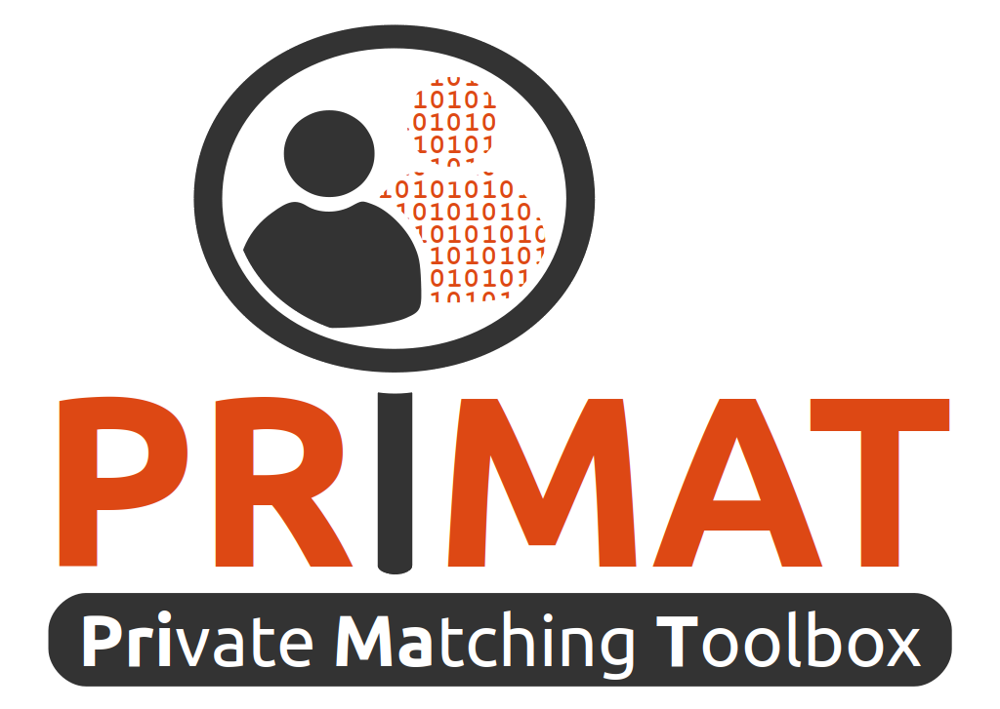

# PRIMAT: Private Matching Toolbox

PRIMAT is an open source (ALv2) toolbox for the definition and execution of PPRL workflows. 
It offers several components for data owners and the central linkage unit that provide state-of-the-art PPRL methods,
including Bloom-filter-based encoding and hardening techniques, LSH-based blocking, metric space filtering,
post-processing and more.

[PRIMAT](https://dl.acm.org/citation.cfm?doid=3352063.3360392) is developed by the [Database Group](https://dbs.uni-leipzig.de/research/projects/pper_big_data) of the University of Leipzig, Germany.

## General

PRIMAT provides two separte applications for data owners and the linkage unit.

### Data Owner App

The data owner application consists of components for pre-processing (data cleaning and stardadization) functions and Bloom-filter-based encoding of records containing person-related data.

To run the data owner application run the following command in the primat directory (where the pom is located):

`mvn clean javafx:run -Dprimat.mainClass=dbs.pprl.toolbox.data_owner.gui.DataOwnerApp`

### Linkage Unit App

The linkage unit application provides linkage functionalities, in particular blocking, similarity calculation and classification, post-processing. Furthermore, it consists of evaluation facilities to compare different PPRL workflows in terms of quality (recall, precision, f-measure) and scalability (runtime, reduction ratio).

To run the linkage unit application run the following command in the primat directory (where the .pom-file is located):

`mvn clean javafx:run -Dprimat.mainClass=dbs.pprl.toolbox.lu.gui.LinkageUnitApp`

## Future Plans

We are currently working on a comprehensive refactoring of the current code base. This includes the separtion of the code into several modules to simplify usage and to improve extensibility and maintainability. Moreover, we plan to gradually add new features releated to our ongoing research.
